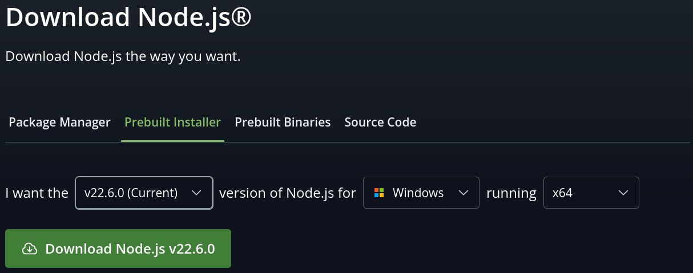

# ESLint

**Pré-requis** : Node.js doit être installé sur votre machine.



Pour cet exercice, vous allez installer ESLint et créer un fichier de configuration de linting pour un projet JavaScript. Le travail sera réalisé dans l'outil de développement Visual Studio Code.

1. Créez un nouveau projet JavaScript dans Visual Studio Code. Placez ce projet dans un dossier nommé `jseslint`.
1. Créez un fichier `index.js` dans le dossier du projet et ajoutez-y le code suivant :

```javascript
console.log('Demo ESLint')
```

1. Installez l'extension ESLint dans Visual Studio Code en recherchant "ESLint" dans la barre de recherche des extensions.
1. Ouvrez le terminal dans Visual Studio Code et installez ESLint en exécutant les commandes suivantes :

```bash
$ npm init
This utility will walk you through creating a package.json file.
It only covers the most common items, and tries to guess sensible defaults.

See `npm help init` for definitive documentation on these fields
and exactly what they do.

Use `npm install <pkg>` afterwards to install a package and
save it as a dependency in the package.json file.

Press ^C at any time to quit.
package name: (jseslint) 
version: (1.0.0) 
description: ESLint projet for learning
entry point: (index.js) 
test command: 
git repository: 
keywords: 
author: Pierre Ferrari
license: (ISC) 
About to write to /your/path/jseslint/package.json:

{
  "name": "jseslint",
  "version": "1.0.0",
  "description": "ESLint projet for learning",
  "main": "index.js",
  "scripts": {
    "test": "echo \"Error: no test specified\" && exit 1"
  },
  "author": "Pierre Ferrari",
  "license": "ISC"
}


Is this OK? (yes) yes
$ npx eslint --init
Need to install the following packages:
eslint@9.33.0
Ok to proceed? (y) y

You can also run this command directly using 'npm init @eslint/config@latest'.
Need to install the following packages:
@eslint/create-config@1.10.0
Ok to proceed? (y) 


> test@1.0.0 npx
> create-config

@eslint/create-config: v1.10.0

✔ What do you want to lint? · javascript
✔ How would you like to use ESLint? · problems
✔ What type of modules does your project use? · esm
✔ Which framework does your project use? · none
✔ Does your project use TypeScript? · No / Yes
✔ Where does your code run? · browser
The config that you've selected requires the following dependencies:

eslint, @eslint/js, globals
✔ Would you like to install them now? · No / Yes
✔ Which package manager do you want to use? · npm
☕️Installing...

added 87 packages, and audited 88 packages in 831ms

24 packages are looking for funding
  run `npm fund` for details

found 0 vulnerabilities
Successfully created /home/pepito/WIP/test/eslint.config.mjs file.
$ tree -L 1
.
├── eslint.config.mjs
├── inDex.js
├── node_modules
├── package.json
└── package-lock.json

2 directories, 4 files
```

Déclarez une variable non utilisée dans le fichier `inDex.js` et observez comment ESLint signale une erreur. Vous pouvez voir que la variable est soulignée en rouge et si vous placez votre curseur dessus, ESLint affiche un message d'erreur.

```javascript
'i' is assigned a value but never used. eslint (no-unused-vars)
```

On peut également voir les erreurs dans la console de Visual Studio Code.

```bash
$ npx eslint index.js 

/your/path/jseslint/index.js
  1:5  error  'i' is assigned a value but never used  no-unused-vars

✖ 1 problem (1 error, 0 warnings)
```

Dans le fichier de configuration `package.json` ajouter une commande pour lancer ESLint ainsi qu'une commande pour _démarrer_ l'exécution du script `index.js`.

```json
{
  "name": "jseslint",
  "version": "1.0.0",
  "description": "ESLint projet for learning",
  "main": "index.js",
  "scripts": {
    "start": "node index.js",
    "lint": "eslint \"**/*.js\" --ignore-pattern node_modules/"
  },
  "author": "Pierre Ferrari",
  "license": "ISC",
  "devDependencies": {
    "@eslint/js": "^9.33.0",
    "@maintained/eslint-plugin-filename-rules": "^1.5.0",
    "eslint": "^9.33.0",
    "eslint-plugin-filename-rules": "^1.3.1",
    "globals": "^16.3.0"
  }
}
```

Puis ajouter les `rules` suivantes dans le fichier de configuration d'eslint (`filenameRules` est installé plus bas) :

**`eslint.config.mjs`**

```javascript
import js from "@eslint/js"
import { plugin as filenameRules } from '@maintained/eslint-plugin-filename-rules'
import globals from "globals"
import { defineConfig } from "eslint/config"

export default defineConfig([
  { 
    files: ["**/*.{js,mjs,cjs}"], 
    plugins: { js, 'filename-rules': filenameRules }, 
    extends: ["js/recommended"], 
    languageOptions: { globals: globals.browser },
    rules: {
      quotes: [ "error", "double" ],
      "no-unused-vars": "error",
      "no-undef": "error",
      "no-implicit-globals": "error",
      "no-const-assign": "error",
      "no-var": "error",
      "prefer-const": "error",
      "array-bracket-spacing": [ "error", "always", { "arraysInArrays": false } ],
      eqeqeq: "error",
      semi: [ "error", "never" ],
      indent: [ "error", 2 ],
      "brace-style": [ "error", "1tbs" ],
      "linebreak-style": [ "error", "unix" ],
      "max-len": [ "error", {"code":80} ],
      "id-match": [
        "error",
        "^[a-z_]+$",
        {
          "properties": true,
          "onlyDeclarations": true
        }
      ],
      'filename-rules/match': [2, 'snake_case'],
    }
  }
])
```

et **`inDex.js`** sans changer quoi que ce soit dans un premier temps.

```javascript
var i = 0;
let arr = [[ 1, 2 ], 2, [ 3, 4],4,[5, 6 ], 7, [8, 9], 10, 11, 12, 13, 14, 15, 16, 17, 18, 19, 20]
console.log('Demo ESLint')

for(y = 0; y < 10; y++)
  {
  console.log(arr[y]);
}

if (i == 10) 
{
  console.log('i is 10')
}
else
{
  console.log('i is not 10')
}
```

Ensuite, démarrer le script avec la commande `npm run start` et lancer ESLint avec la commande `npm run lint`. 

Vous pouvez constater que le script fonctionne très bien mais qu'il ne respect pas les règles de linting. 

### Exercice 1

Uniquement à l'aide de la documentation officielle, ajouter les règles suivantes:

- Forcer l'utilisation des guillemets à la place des apostrophes
- Interdire les déclarations de variables ou de fonction dans le scope global
- Interdire le redéfinition de variables constantes
- Interdire l'utilisation du mot clé `var`
- Forcer l'utilisation des variables constantes si elles ne sont jamais redéfinies
- Forcer l'utilisation d'espaces dans les tableaux `const arr = [ 'foo', 'bar' ]`
- Interdit les espaces s'il y a des tableaux dans des tableaux `let arr = [[1, 2], [3, 4]]`
  - Résumé:
    `let arr = [[ 1 ], [ 2 ]]` OK
    `let arr = [ [ 1 ], [ 2 ] ]` KO
    `let tab = [ 1, 2, 3 ]` OK
    `let tab = [1, 2, 3]` KO
- Forcer l'utilisation des comparaisons triples `===`, `!==`
- Interdire le `;` en fin de ligne
- Forcer l'indentation à 2 caractères espace

**TIPS**: array-bracket-spacing, semi, no-undef, no-unused-vars, no-const-assign, no-var, no-implicit-globals, eqeqeq, indent, prefer-const

### Exercice 2

Uniquement à l'aide de la documentation officielle, trouver et ajouter les règles de linting permettant de détecter les erreurs suivantes :

- Le code source ne doit pas dépasser une longueur de 80 caractères par lignes. Cette règle permet de garantir une meilleure lisibilité du code.
- Les blocs de code doivent être indentés avec une tabulation. Cette règle permet de garantir une meilleure cohérence dans la mise en forme du code.
- Les noms des variables respect la notation `snake_case`
- Les noms des fichiers doivent être en minuscule (`snake_case`)
- Les noms des dossiers doivent être en minuscule (`snake_case`)
- Les blocs if/else doivent respecter la convention _The one true brace style_. Cette convention consiste à placer les accolades ouvrantes sur la même ligne que la déclaration du bloc if/else et les accolades fermantes sur une nouvelle ligne. Par exemple :

```javascript
if (condition) {
    // code
} else {
    // code
}
```

#### Installation

```bash
$ npm install -D @maintained/eslint-plugin-filename-rules

added 2 packages, and audited 91 packages in 3s

25 packages are looking for funding
  run `npm fund` for details

found 0 vulnerabilities
``` 

Si vous reprenez le code d'exemple fournit plus haut sans faire de modification, vous devriez obtenir les erreurs suivantes :

```bash
$  npm run lint

> jseslint@1.0.0 lint
> eslint "**/*.js" --ignore-pattern node_modules/


/home/pepito/WIP/test/inDex.js
   1:1   error  Filename 'inDex.js' does not match snake_case                                  filename-rules/match
   1:1   error  Unexpected var, use let or const instead                                       no-var
   1:10  error  Extra semicolon                                                                semi
   2:1   error  This line has a length of 97. Maximum allowed is 80                            max-len
   2:5   error  'arr' is never reassigned. Use 'const' instead                                 prefer-const
   2:31  error  A space is required before ']'                                                 array-bracket-spacing
   2:35  error  A space is required after '['                                                  array-bracket-spacing
   2:47  error  A space is required after '['                                                  array-bracket-spacing
   2:52  error  A space is required before ']'                                                 array-bracket-spacing
   2:97  error  A space is required before ']'                                                 array-bracket-spacing
   3:13  error  Strings must use doublequote                                                   quotes
   5:5   error  'y' is not defined                                                             no-undef
   5:12  error  'y' is not defined                                                             no-undef
   5:20  error  'y' is not defined                                                             no-undef
   6:1   error  Expected indentation of 0 spaces but found 2                                   indent
   6:3   error  Opening curly brace does not appear on the same line as controlling statement  brace-style
   7:19  error  'y' is not defined                                                             no-undef
   7:22  error  Extra semicolon                                                                semi
  10:7   error  Expected '===' and instead saw '=='                                            eqeqeq
  11:1   error  Opening curly brace does not appear on the same line as controlling statement  brace-style
  12:15  error  Strings must use doublequote                                                   quotes
  13:1   error  Closing curly brace does not appear on the same line as the subsequent block   brace-style
  15:1   error  Opening curly brace does not appear on the same line as controlling statement  brace-style
  16:15  error  Strings must use doublequote                                                   quotes
  19:7   error  Identifier 'myVariable' does not match the pattern '^[a-z_]+$'                 id-match
  20:1   error  'myVariable' is constant                                                       no-const-assign
  20:1   error  'myVariable' is assigned a value but never used                                no-unused-vars

✖ 27 problems (27 errors, 0 warnings)
  17 errors and 0 warnings potentially fixable with the `--fix` option.
```

Une fois que vous obtenez toutes les erreurs, et donc que votre fichier de configuration d'ESLint est correct, vous pouvez les corriger pour les faire disparaître.
